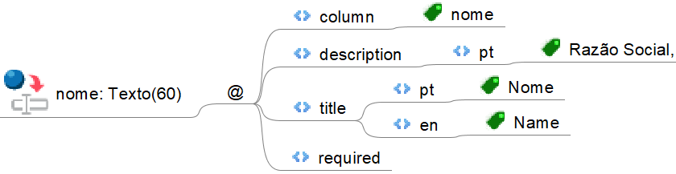
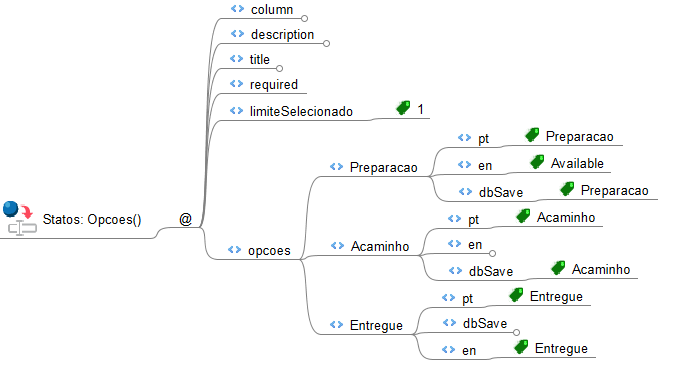

# componentes


## 1. Inputs 

 Os inputs são componentes simples e adaptáveis ao tipo de dado definido. De forma geral, consistem em uma caixa retangular para entrada de dados, acompanhada de um rótulo (label) e com comportamento responsivo.
Eles podem ser configurados como campos obrigatórios ou opcionais.

```
<nomeAtributo>: <Tipo>(<limiteOpcional>)
    @
        column
            <nome_coluna_no_banco>
        title
            pt-br
                <Título em português>
            en
                <Title in English>
        description
            <descrição em pt ou en>
        required          ← (opcional) marca como obrigatório
        searchable        ← (opcional) marca como pesquisável
        (demais propriedades específicas)
```
### resultado

<div class="outlined-textfield">
  <input type="text" placeholder="" id="nome" />
  <label for="nome">Nome</label>
</div>

### 1.1 Types e mascaras

**Inputs**
- `Texto(n)`: String com limite de n caracteres
- `TextoLongo()`: texto sem limite definido (maior capacidade para banco de dados)
- `Numero(n)`: número (com n limite)
- `Inteiro()`: número inteiro (apenas numeros possitivos)
- `Double()`: número decimal

**Inputs com mascaras**
- `Email()`: campo com máscara de e-mail
- `CPF()`, `CNPJ()`, `CPFCNPJ()`: campos com máscara para documentos
- `Telefone()`, `Celular()`, `TelefoneCelular()`: campos com máscara

**Checkbox**
- `Boolean()`:  valor verdadeiro ou falso

**Calendar**
- `Data()`: campo de data
- `Time()`: campo de hora
- `DateTime()`: campo com data e hora

**Select**
- `Opcoes()`: campo com opcoes para selecionar 1 ou mais

****

### Exemplo



```
nome: Texto(60)
    @
        column
            nome
        title
            pt-br
                Nome
            en
                Name
        description
            pt
                Nome completo do cliente
        required
```

### 1.2 Tipo `Opcoes()` (Select)

Permite criar listas de seleção com valores definidos.


para isso deve 
* colocar o tipo `Opcoes()` no campo 
* propriedades do atributo deve inserir `limiteSelecionado` com valores inteiros
* `opcoes`, onde cada valor deve ter:
<!--  - `pt` o titulo em pt-br
  - `en` o titulo em ingles
  - `dbSave` o nome que serar salvo no banco de dados -->
```
<nomeAtributo>: Opcoes()
    @
        column
            <nome_coluna_no_banco>
        title
            pt-br
                <Título em português>
            en
                <Title in English>
        required
        limiteSelecionado
            1
        opcoes
            <exemplo1>
                pt
                    <exemplo1_nome_opcao_portugues>
                en
                    <exemplo1_nome_opcao_ingles>
                dbSave
                    <exemplo1_nome_opcao_registrado_banco_dados>
            <exemplo2>
                pt
                    <exemplo2_nome_opcao_portugues>
                en
                    <exemplo2_nome_opcao_ingles>
                dbSave
                    <exemplo2_nome_opcao_registrado_banco_dados>

            (...)
```

### Exemplo

```
tipoConta: Opcoes()
    @
        column
            tipo_conta
        title
            pt-br
                Tipo de Conta
            en
                Account Type
        required
        limiteSelecionado
            1
        opcoes
            Corrente
                pt
                    Corrente
                en
                    Checking
                dbSave
                    corrente
            Poupança
                pt
                    Poupança
                en
                    Savings
                dbSave
                    poupanca
            Pagamento
                pt
                    Pagamento
                en
                    Payment
                dbSave
                    pagamento

```


## 2. Formulário de Steps

Para utilizar o Formulário em Steps (etapas), é necessário configurar a classe da seguinte forma:

1. Definir a propriedade `isFormStepper` com o valor `true`, indicando que será utilizado o formulário em etapas.
1. Adicionar a propriedade `formTabs` com a lista de grupos (etapas) do formulário, na ordem desejada (de cima para baixo).
### Exemplo de definição na propriedade da classe:
```
@
    (...)
    isFormStepper
        true
    formTabs
        <passo 1>
        <passo 2>
        <passo 3>
    (...)
```
### Atributos no Formulário com Steps
Cada campo (atributo) do formulário deve indicar a etapa (tab) à qual pertence, utilizando a anotação `formTab`.

Estrutura do atributo:
```
<nomeDoAtributo>: <Tipo>(<opcional>)
    @
        (...)
        formTab
            <passo 2>

```
### Exemplo completo:
- propriedade
```
@
    (...)
    isFormStepper
        true
    formTabs
        Dados
        Veiculos
        Importacao
    (...)

```
- atributo
```
nomeCliente: Texto(60)
    @
        column
            nome_cliente
        description
            pt-br
                Nome do cliente ou da empresa.
        title
            pt-br
                Nome Cliente
        formTab
            Dados
        required
        searchable

```

## tipos
opcoes
arquivo

sub forms
Menus
Consultas
Ambientes

---


